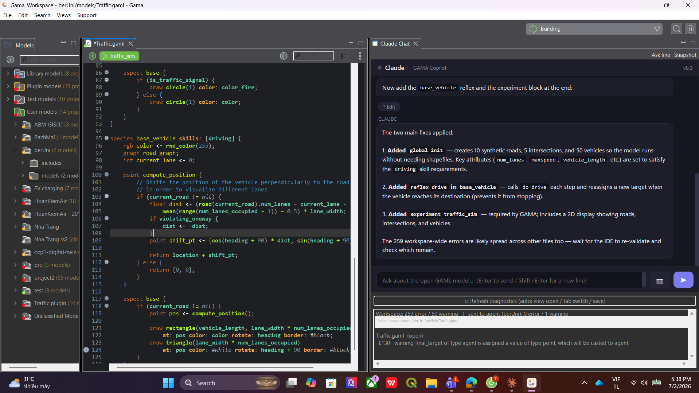

# Claude in GAMA

An Eclipse plugin that puts a live **Claude chat panel inside the
[GAMA Platform](https://gama-platform.org/) IDE**, wired to the compiler's own
error markers. The red squiggles in the GAML editor become structured data
(file, line, message) that both you and the model see, so Claude knows exactly
what is broken and where, fixes it with real file edits, and the IDE
re-validates on the spot. No 30-second headless restarts, no copy-pasting
errors into a browser.

Built on the [Claude Agent SDK](https://docs.anthropic.com/en/api/agent-sdk/overview):
the plugin is a thin Java layer (chat view + marker bridge), the brain is a
Python agent it spawns locally.

## Screenshots

*A real session: the model had 2 compile errors; the agent read the live
diagnostics, fixed the file (approval cards on each edit), the IDE re-validated
and the experiment button came back:*



## What it does

- **Chat view docked in GAMA** (WebView2/SWT Browser), aware of the file you
  have open.
- **Live diagnostics bridge**: every save triggers Xtext validation; the plugin
  turns the resulting markers into JSON and attaches the active project's
  errors to your next message. Whole-workspace noise is reduced to a one-line
  count.
- **Real fixes**: the agent Reads your code, Edits the file on disk, the plugin
  refreshes the workspace, GAMA re-validates, and the next turn carries the
  fresh diagnostics. The loop closes without leaving the IDE.
- Example of a real session: a model called a `global` action from inside a
  species without the `world.` prefix -> 2 compile errors at lines 381-382.
  Asked "fix the gen_cost error", the agent found the GAML scoping rule, edited
  both call sites, and the "Impossible to run any experiment" banner turned
  back into the run button.

## Architecture

```
GAMA (Eclipse RCP + Xtext)
└─ gama.ui.claude (this plugin, Java)
   ├─ ChatView      SWT Browser, chat UI in HTML/JS
   ├─ MarkerBridge  IMarker -> JSON, auto-rescan on change
   └─ AgentHost     spawns agent/ide_agent.py, JSON lines over stdio
                      └─ Claude Agent SDK -> Claude API
```

Guardrails live in code, not prompts: the Python agent only gets Read/Grep/Glob
plus Edit/Write restricted to the project of the model you're working on (or a
folder you pick via the view's "Context folder" action). No shell access.

## Install

Requirements: GAMA 2025.x (its bundled JDK 21 is used to compile), Python >= 3.10
with `claude-agent-sdk` in a venv, Node.js >= 20, Git Bash on Windows (or any
bash on macOS/Linux).

```bash
git clone <this repo>
cd gama-claude-plugin

# 1. build + install into GAMA (auto-detects the install; else set GAMA_DIR)
bash build.sh

# 2. python side
python -m venv .venv && . .venv/Scripts/activate   # or bin/activate
pip install claude-agent-sdk

# 3. config: copy gama-claude.properties.example to ~/.gama-claude.properties
#    fill python=, script=, and ONE of oauth_token= / key=

# 4. restart GAMA -> the "Claude Chat" view opens by itself
```

Auth note: `oauth_token=` (from `claude setup-token`, uses your Claude
subscription) or `key=` (API credits). The agent runs the CLI with an isolated
`CLAUDE_CONFIG_DIR`, so whatever is in your `~/.claude/settings.json` (proxies,
model overrides) cannot hijack it.

To uninstall: delete the `gama.ui.claude,...` line from
`<GAMA>/configuration/org.eclipse.equinox.simpleconfigurator/bundles.info` and
remove the jar from `<GAMA>/plugins/`. A backup of bundles.info is written on
first install.

## Status / roadmap

- [x] M0 view + marker scan
- [x] M1 live diagnostics JSON, library-noise filter, active-file-first
- [x] M2 chat wired to the agent, auto refresh + revalidate after edits
- [x] M2.5 diagnostics scoped to the active project (token diet)
- [x] M3 "Ask Claude" on error lines, edit approval cards with a diff preview
      (`auto_approve=true` to skip), Stop button
- [x] M3.5 UX pass: auto-refresh diagnostics (view open / tab switch / save),
      "Ask Claude: dòng này" in the editor right-click menu (GAMA's Xtext editor
      doesn't surface external marker resolutions, so the context menu is the
      reliable path), chat UI overhaul (markdown, tool chips, typing indicator,
      readable diagnostics panel)
- [x] M4 window snapshots: the camera button captures the GAMA window to a PNG
      that is attached to your next message; the agent Reads the image to
      visually inspect displays and charts
- [x] English-only UI; Ctrl+Alt+C shortcut + view-toolbar "Ask line" button
      (fallbacks for the Xtext editor context menu)
- [x] M5 (v0.2.0): project-wide context - the agent receives the active file's
      project root, may edit anywhere inside it, and is prompted to Glob/Grep
      related .gaml files first; a "Context folder" toolbar action overrides the
      root manually. Clear-conversation button (trash icon in the header) kills
      the agent session so the next message starts with zero carried-over
      context. Installer now removes stale plugin versions so UI updates always
      load after a GAMA restart.

## Why not headless?

GAMA's `gama-headless -validate` doesn't check *your* file (built-in library
only), `-xml` does but costs a full JVM start per check and reports no line
numbers. The IDE's Xtext markers are instant and carry exact positions. This
plugin simply hands them over.

## License

MIT
