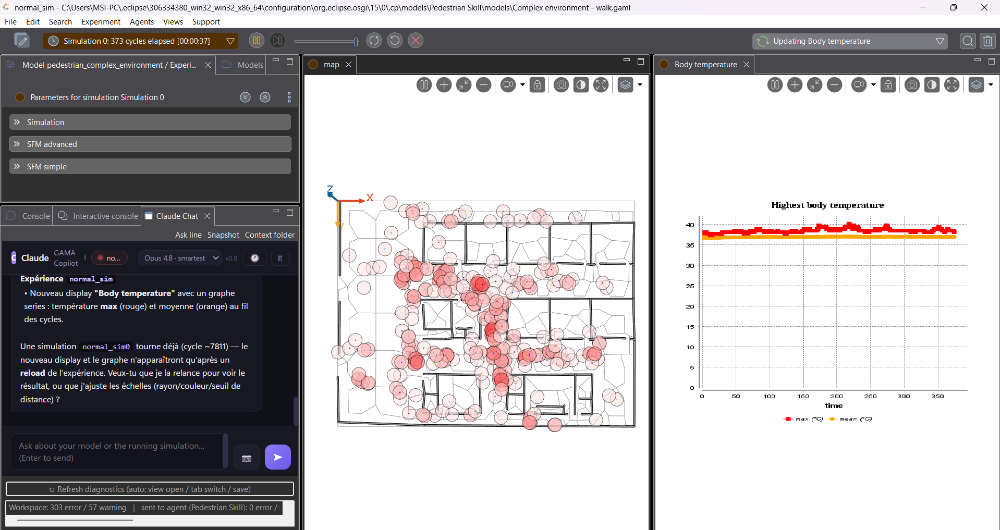
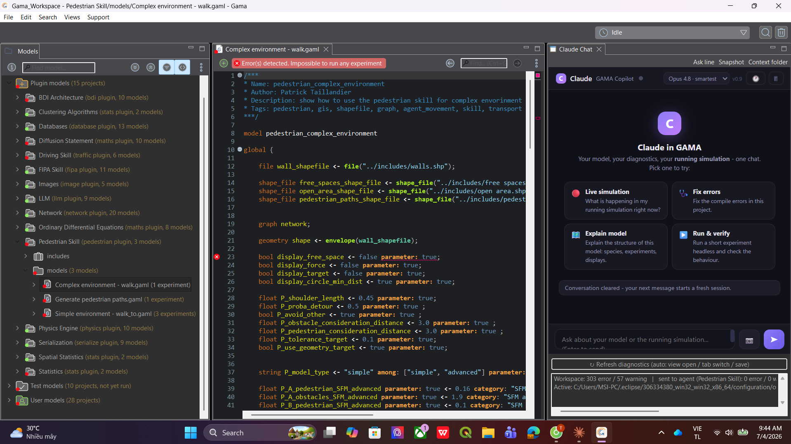
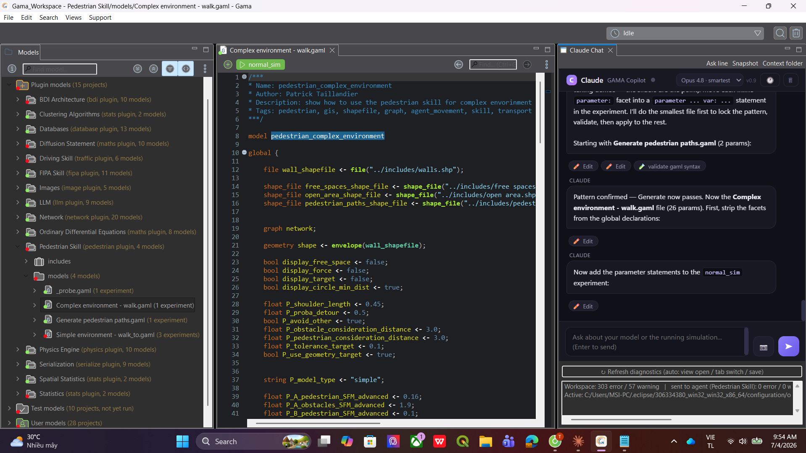
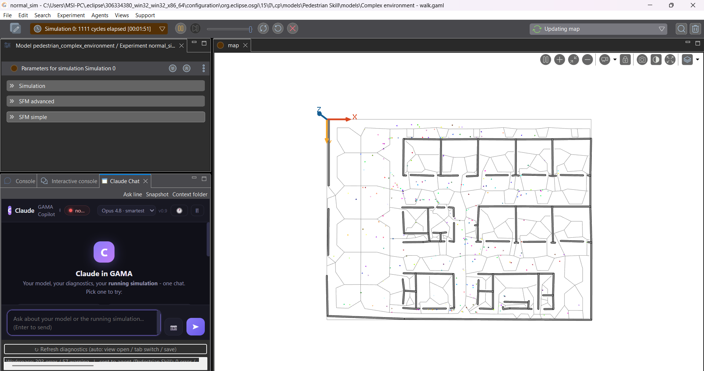
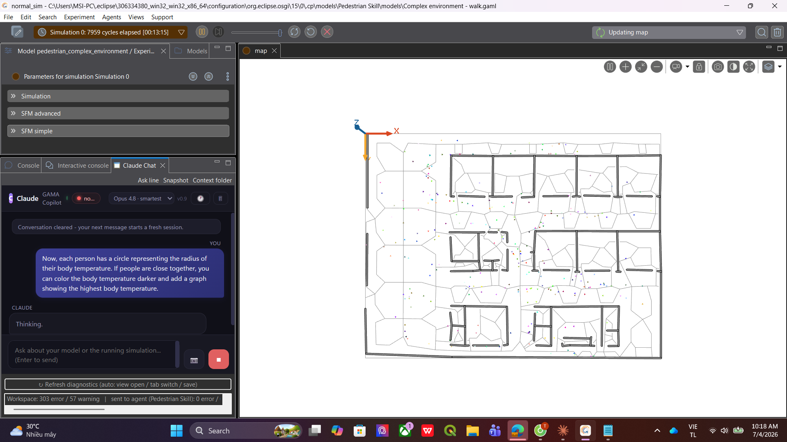
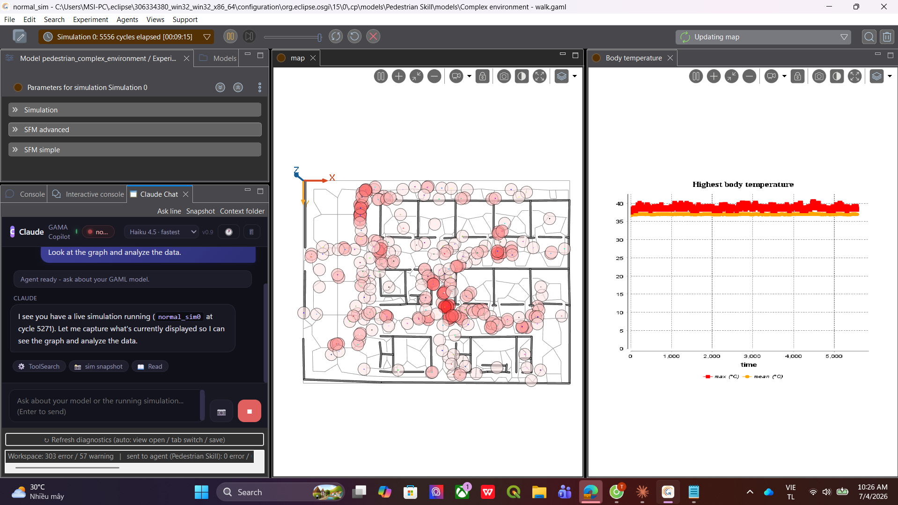
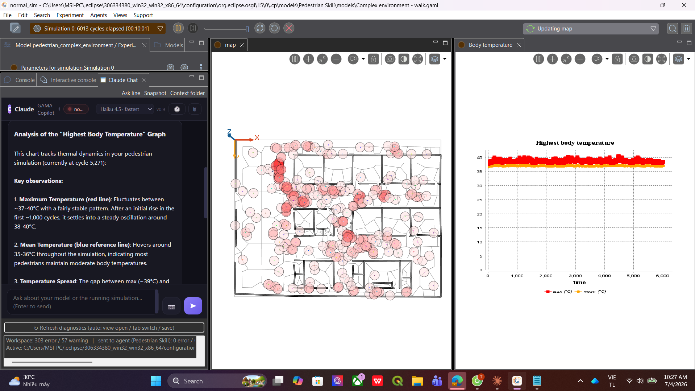

# Claude in GAMA

**An AI agent — not another chatbot — living inside the [GAMA Platform](https://gama-platform.org/) IDE and inside your running simulation.**

A chatbot answers questions about code it has never seen. An agent acts: this
one reads your compiler errors, edits your files (with your approval), runs
your experiments to check its own work, and reaches into the live simulation
while it runs.

Most GAMA users are not programmers. They are ecologists, urban planners,
epidemiologists, geographers, students — people who came for the
*simulation*, and GAML is just the price of admission. I kept watching
newcomers hit their first compiler error and do the only thing they could:
copy-paste it into a chatbot that has never seen their project and barely
knows GAML. So I put the agent *inside* GAMA. It sees what the IDE sees: the
compiler errors with exact lines, every model in the workspace, the console.
And it sees what the **simulation** sees: while your experiment is running it
can pause it, read agent state, change the world, step cycle by cycle, and
literally *look at* the displays you are looking at.

Here is the moment that sold me on my own tool. My pedestrian simulation was
running. I typed one message — *"give each person a circle showing their body
temperature, darker when people are close together, and add a graph of the
highest temperature"* — and after a reload this is what I got:



New attribute, new reflex, new aspect, a whole new chart display. I never
opened the editor.

## What it can do

### Fix the errors in your project

Open a broken project and the chat already knows. The plugin feeds GAMA's own
Xtext diagnostics to the agent — exact files, exact lines, no copy-pasting.
The welcome screen gives you one-click starters:



I clicked **Fix errors** on a project where the banner said *"Impossible to
run any experiment"*. It read the files, made the edits (every one shows a
real diff you approve), validated the model headlessly, and the run button
came back green:



### Start a brand-new project from one message

There doesn't have to be a project yet. Describe what you want and the agent
builds the whole thing — project folder, model file, species, reflexes,
experiment, displays — and auto-imports it into the navigator, ready to run.
My caro (gomoku) game and my chess game each started life as a single chat
message. And if you ask it to, it proves the model works before handing it
over: it runs the experiment headless in the background, reads the monitor
values step by step and the display snapshots, and only then tells you it's
done.

### Change your model while the simulation runs

This is the part no generic AI IDE can do. The chat is docked right next to
the Console in the simulation perspective, and every message you send carries
a live status line — current cycle, parameters, monitors — so the agent always
knows a sim is up:



So you just... ask for things. Here I asked for the body-temperature feature
while the sim was at cycle 7959:



It edited the model, told me a reload was needed (a running sim keeps its old
code — that's GAMA, not the plugin), and one reload later I had the circles
and the chart you saw at the top.

### It can look at your displays

`sim_snapshot` captures each display of the running experiment to PNG and the
agent *reads the image*. Here I switched the model picker to Haiku (fastest)
and asked it to look at the graph:



And it answers from what it actually sees — the max/mean temperature lines,
the oscillation, the spread:



### The full toolbox

- **Live simulation bridge** — `sim_status` (cycle, parameters, monitors,
  displays), `sim_eval` (run *any* GAML against the live world, expressions
  **and** statements: `ask people { ... }`, `create predator number: 5;` —
  displays refresh instantly), `sim_control` (pause / resume / step / step
  back / reload), `sim_snapshot` (per-display PNG the agent can read).
- **Project intelligence** — every `.gaml` is parsed into a cached semantic
  index; each message carries a compact project map (files, species,
  experiments, displays, with line numbers). `gaml_outline` and
  `find_gaml_symbol` navigate without reading whole files.
- **Run-and-verify loop** — `validate_gaml_syntax` compile-checks headlessly,
  `run_experiment_headless` runs any experiment with a step cap and returns
  monitor values per step plus display snapshots, `read_ide_console` tails
  the IDE console. The agent doesn't guess whether its fix works — it runs it.
- **Safe edits, by construction** — guardrails live in code, not prompts.
  Read/edit is hard-limited to your project folder. No shell access, ever.
  Every edit shows a diff card, every applied edit is snapshotted and
  undo-able from the History panel.
- **IDE conveniences** — model picker in the header (Opus for the hard stuff,
  Haiku when you want speed), window snapshot button, "Ask Claude" on any
  error line (right-click or Ctrl+Alt+C), context-folder override, one-click
  fresh session.

## Why not just use Cursor?

GAMA is a *simulation* platform. The loop is not `write → compile → ship`, it
is `write → compile → run → watch what emerges → adjust`. A generic AI IDE
stops at the file level. It can never tell you why the epidemic dies out at
cycle 300, because it can't see cycle 300. And the people who model in GAMA
are mostly scientists, not developers — asking them to move their work into a
programmer's editor to get AI help is exactly backwards. The help should come
to where they already are.

| A generic AI IDE | Claude in GAMA |
|---|---|
| Sees files | Sees files + live Xtext diagnostics + a semantic index of the workspace |
| Greps for symbols | `find_gaml_symbol` over every species/action/reflex/experiment |
| Runs shell commands | No shell. Purpose-built tools: compile-check, headless runs, live-sim bridge |
| Can't run your GUI model | Runs any experiment headless, reads monitors per step, reads the display PNGs |
| Can't touch a running program | Pauses, steps, inspects and **mutates** the live simulation, and screenshots its displays |
| Free-form edits | Real diff cards, snapshot before every edit, per-entry undo |

## Architecture

```
GAMA (Eclipse RCP + Xtext)
└─ gama.ui.claude (this plugin, Java)
   ├─ ChatView       SWT Browser chat UI + JSON-lines stdio to the agent
   ├─ MarkerBridge   IMarker -> JSON, auto-rescan on save/tab-switch
   ├─ ConsoleBridge  read-only console mirror, refreshed during a turn
   ├─ SimBridge      live bridge into the RUNNING experiment (gama.core):
   │                   status / pause / resume / step / reload,
   │                   GAML eval (Interactive-Console engine, statements too),
   │                   per-display PNG capture
   └─ AgentHost      spawns agent/ide_agent.py
        └─ Claude Agent SDK -> Claude API
           ├─ gaml-tools   outline / find symbol / project map (cached index)
           ├─ gama-tools   validate / run headless / read outputs / console
           ├─ gama-sim     sim_status / sim_eval / sim_control / sim_snapshot
           │                 (RPC over stdio -> SimBridge in the IDE process)
           └─ edit_history pre-edit snapshots, diff cards, undo journal
```

The sim tools are a tiny RPC channel: the Python agent emits
`{"type":"sim_cmd",...}`, the Java plugin executes it on the GAMA runtime and
answers with `sim_reply`. Same trusted process, no extra ports, no server.

## Install

Requirements: GAMA 2025.x (its bundled JDK is used to compile), Python ≥ 3.10
with `claude-agent-sdk`, Node.js ≥ 20, bash (Git Bash on Windows).

```bash
git clone https://github.com/mr-thangceoaka/gama-claude-plugin
cd gama-claude-plugin

# 1. build + install into GAMA (auto-detects the install; else set GAMA_DIR)
#    GAMA must be closed, or the old jar can't be replaced
bash build.sh

# 2. python side
python -m venv .venv && . .venv/Scripts/activate   # or bin/activate
pip install claude-agent-sdk

# 3. config: copy gama-claude.properties.example to ~/.gama-claude.properties
#    fill python=, script=, and ONE of oauth_token= / key=

# 4. start GAMA -> the "Claude Chat" view opens by itself
```

Auth: `oauth_token=` (from `claude setup-token`, uses your Claude
subscription) or `key=` (API credits). The agent runs with an isolated
`CLAUDE_CONFIG_DIR`, so proxies or model overrides in your own
`~/.claude/settings.json` cannot hijack it.

Uninstall: delete the `gama.ui.claude,...` line from
`<GAMA>/configuration/org.eclipse.equinox.simpleconfigurator/bundles.info` and
remove the jar from `<GAMA>/plugins/` (a bundles.info backup is written on
first install).

## Why not headless-only?

GAMA's `gama-headless -validate` doesn't check *your* file (built-in library
only); `-xml` does, but costs a full JVM start per check and reports no line
numbers. The IDE's Xtext markers are instant and exact — the plugin just hands
them over. Same story at runtime: headless re-runs are great for reproducible
checks (the agent uses them), but only the live bridge lets you ask about
*the* simulation you are watching, with its exact seed and history.

## Version history

The project grew in milestones, each one tested for real inside the GUI.
What changed from version to version:

**v0.1.0 (M0–M4)** — the starting point. A Claude Chat view inside GAMA,
GAMA's error markers converted to JSON and attached to your messages, "Ask
Claude" on any error line, edit approval cards with a diff preview, a Stop
button, and a window-snapshot button so the agent could see the IDE.

**v0.2.0 (M5)** — from single-file to project-wide. The agent got the whole
project as context, a "Context folder" override to point it anywhere, a
clear-conversation button, and the installer learned to remove stale plugin
versions.

**v0.3.0 (M6)** — the verify loop. Headless validate and run tools, so the
agent could check its own fixes instead of guessing. New projects created by
the agent are auto-imported into the navigator.

**v0.4.0 (M7)** — the big overhaul. Workspace semantic index with a project
map on every message, `gaml_outline` / `find_gaml_symbol`, an IDE console
mirror, `run_experiment_headless` for *any* experiment with monitors per step
plus snapshot PNGs, unified-diff approval cards, and a full edit history with
per-entry Undo. Read scope enforced in code via hooks, not prompts.

**v0.5.0 (M8)** — the live simulation bridge, the feature this whole project
was heading toward. `sim_status`, `sim_eval` (expressions and world-mutating
statements, same engine as GAMA's Interactive Console), `sim_control`
(pause/resume/step/reload), `sim_snapshot` (per-display PNG). Live sim status
attached to every message.

**v0.5.1–v0.5.5 (M8.1–M9.1)** — making it feel native. The chat survives
perspective switches, docks into the console stack of the simulation
perspective, got a UI overhaul with a live-sim badge in the header, a model
picker (Opus / Sonnet / Haiku), and a welcome screen with one-click starter
prompts.

## License

MIT
